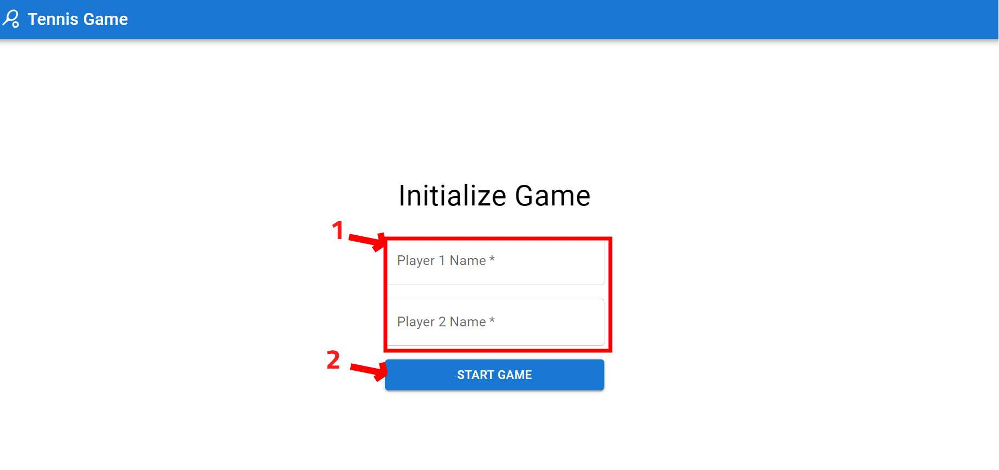
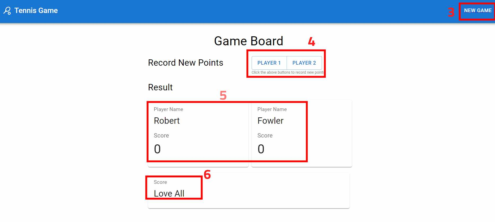

# Tennis Game
Tennis Game Kata implementation.  
Find more about each folder by clicking on the folder name (read the README inside each folder):

| **Apps**     | **Description** |
| :----------: | :-------------: |
| [Api](./api) | Backend REST API |
| [Web](./web) | Frontend App |

## Get Started
### Perquisites
Make sure you have:
- [Git](https://git-scm.com/)
- [Docker](https://www.docker.com/) (make sure you have installed `docker-compose` with it)

### Run it locally
1. Open terminal and clone the repo:
```shell
git clone https://github.com/2022-DEV1-038/Tennis.git
```
2. Make sure you are in project root:
```shell
cd Tennis
```
3. Build and run the app in containers:
```shell
docker-compose up -d
```
4. Open [http://localhost:3000](http://localhost:3000) to view the app in your browser.

## User's Manual (How to play)
Find below description of the important elements of the user interface:

| Page | Description |
|:------:|:---------:|
|  | 1. Type players name<br/> 2. Click Start Game to enter into the game board and start playing |
|  | 3. To start a new game<br/> 4. Record new points<br/> 5. Current players names and their scores<br/> 6. Total score |